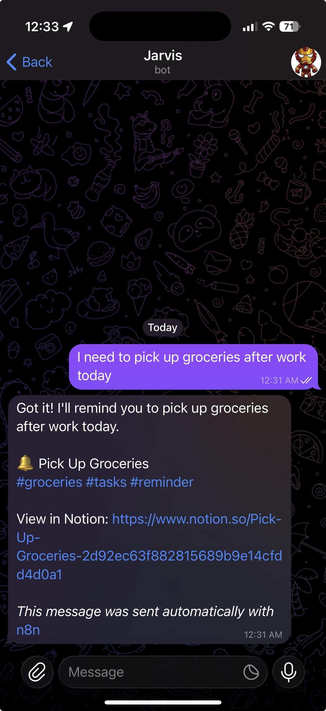

# Jarvis - Your Personal AI Assistant

A personal AI assistant built on n8n that helps you manage tasks, capture ideas, and stay focused through Telegram.


## Features

- **Natural Language** - Talk to Jarvis like a human, via text or voice
- **Smart Intent Detection** - Understands if you're asking, commanding, or capturing
- **Voice Transcription** - Send voice notes, get them transcribed and processed
- **Context Memory** - Remembers recent conversations ("mark that done", "snooze the first one")
- **Morning Briefing** - Daily digest with weather, priorities, and strategic advice
- **Smart Notifications** - Reminders, deadline alerts, weekly reviews

<p align="center">
  
</p>

### Quick Commands
| Command | What it does |
|---------|--------------|
| `/today` | Today's tasks |
| `/week` | This week's items |
| `/overdue` | Overdue tasks |
| `/high` | High priority |

### Natural Commands
```
"Remind me to call John tomorrow at 3pm"
"What's on my plate today?"
"Done with the first one"
"Push that to next Monday"
"What should I prioritize?"
```

## Setup

### Prerequisites
- [n8n](https://n8n.io/) instance (self-hosted or cloud)
- Telegram Bot ([@BotFather](https://t.me/botfather))
- Notion workspace with API integration
- OpenAI API key

### Quick Start

```bash
# Clone and configure
git clone https://github.com/yourusername/jarvis-n8n.git
cd jarvis-n8n
cp .env.example .env
```

Edit `.env`:
```bash
TELEGRAM_CHAT_ID=123456789          # Get from @userinfobot
NOTION_MAIN_DB_ID=abc123...         # From Notion database URL
NOTION_CONVERSATIONS_DB_ID=def456...
WEATHER_LATITUDE=27.9506            # Your location
WEATHER_LONGITUDE=-82.4572
```

```bash
# Generate configured workflows
node setup.js

# Then import workflows from /configured into n8n
```

### Notion Database Setup

<details>
<summary>Create two databases with these properties</summary>

**Main Database (Jarvis)**
| Property | Type |
|----------|------|
| Name | Title |
| Summary | Text |
| Note Type | Select (`reminder`, `task`, `idea`, `meeting-notes`, `journal`, `reference`, `question`) |
| Priority | Select (`high`, `medium`, `low`) |
| Status | Select (`pending`, `completed`, `archived`) |
| Tags | Multi-select |
| Reminder Date | Date |
| Deadline | Date |

**Conversations Database**
| Property | Type |
|----------|------|
| Message ID | Title |
| Chat ID | Number |
| User Message | Text |
| Intent | Select (`query`, `command`, `capture`) |
| Timestamp | Date |

Don't forget to connect both databases to your Notion integration!
</details>

## Roadmap

Looking for contributors! These are features I'm planning to add:

- [ ] Google Calendar integration (two-way sync)
- [ ] Recurring tasks & habits
- [ ] Link summarizer (send URL, get AI summary)
- [ ] Email digest integration
- [ ] Habit streaks & analytics
- [ ] Multi-user support
- [ ] Web dashboard for Notion data
- [ ] Slack/Discord integration

PRs welcome!

## Tech Stack

- **n8n** - Workflow automation
- **Telegram** - User interface
- **Notion** - Data persistence
- **OpenAI GPT-4o** - Intent detection & AI advice
- **OpenAI Whisper** - Voice transcription
- **Open-Meteo** - Weather (free, no key)

## License

MIT
